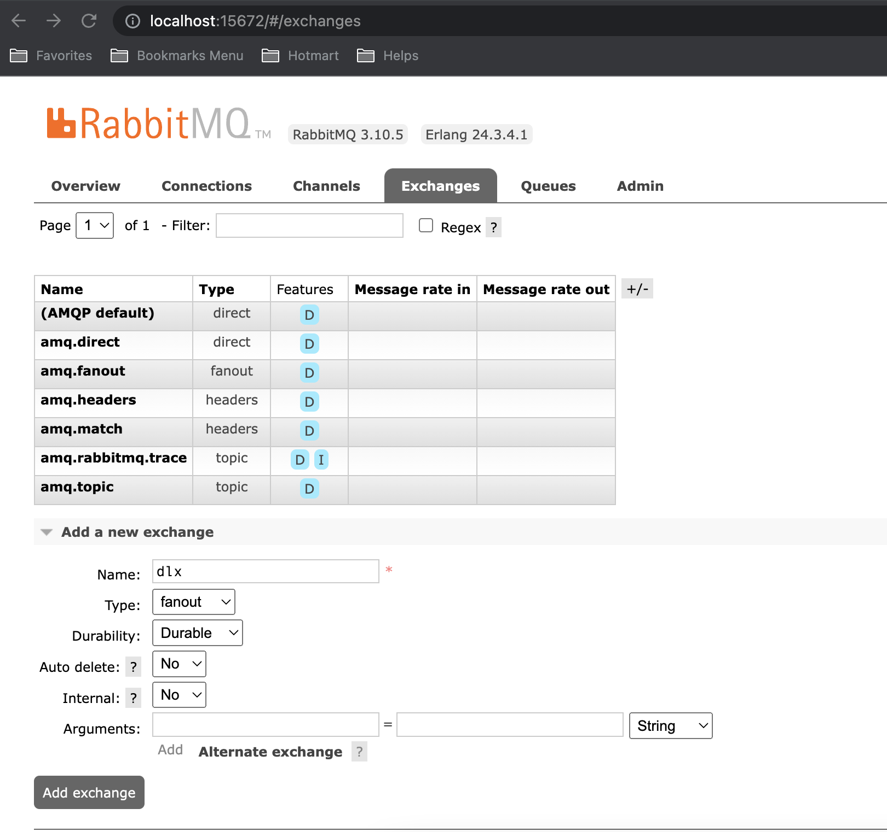

# Microsserviço para encoder de vídeo

- Dockerfile para o projeto obtido de: https://gist.github.com/wesleywillians/9dcee3aa242ffb6bc92e7f0fdbc7aadd

- Para iniciar rodar o comando:

```shell
docker compose up --build
```

- Esse comando irá deixar o processo rodando no terminal, para poder continuar utilizando o terminal podemos utilizar esse comando ao invés:

```shell
docker compose up -d
```

- Para acessar o container executar o comando:

```shell
docker compose exec app bash
```

---

## go mod

- utilizamos para gerenciar as versões dos nosso projeto

- Criamos a pasta `encoder/` e dentro dela rodar o comando:

```shell
go mod init encoder
```

- Com isso será criado um arquivo `go.mod`

- E o go.mod serve para gerenciar as nossas dependencias.

- Ao executar o comando:

```shell
go run main.go
```

- Caso o pacote não esteja instalado ele irá baixar a dependencia para nós automáticamente ou seja ele irá realizar um `go get` do pacote

- E ele gera um arquivo `go.sum` que é um arquivo lock das dependencias


---

### Testes

- Pacote para testes: github.com/stretchr/testify/require

- Para realizar um test primeiro criamos o arquivo `encoder/domain/video_test.go`
- Para executar os testes utilizar o comando dentro da pasta  raiz:

```shell
go test ./...
```

- Pois assim ele irá executar todos os testes que encontrar.

- Muitas vezes é interesante limpar o cache dos testes podemos fazer isso executando esse comando:

```shell
go clean -testcache
```

---

### Validation

- Pacote para validação: github.com/asaskevich/govalidator

- Exemplo de uso:

```go
type Job struct {
	ID               string    `valid:"uuid"`
	OutputBucketPath string    `valid:"notnull"`
	Status           string    `valid:"notnull"`
	Video            *Video    `valid:"-"` // O * é um ponteiro para um objeto no caso o objeto Video ou seja aponta para o mesmo local da memória do objeto Video
	VideoID          string    `valid:"-"`
	Error            string    `valid:"-"`
	CreatedAt        time.Time `valid:"-"`
	UpdatedAt        time.Time `valid:"-"`
}
```

---

### UUID

- Pacote para gerar uuid: github.com/satori/go.uuid


---

### Visibilidade

- Quando eu quero que uma func seja visivel fora do pacote inicio ela com letra maiuscula, caso queira que ela seja visivel fora do package utilizo a primeira letra maiuscula


---

### ORM

- Lib para utilizar: github.com/jinzhu/gorm

- Exemplo de conexão: `encoder/framework/database/db.go` e `encoder/.env`

- Utiliziamos a anotação gorm:

- Definindo os campos:

```go
type Video struct {
	ID         string    `json:"encoded_video_folder" valid:"uuid" gorm:"type:uuid;primary_key"`
	ResoruceID string    `json:"resource_id" valid:"notnull" gorm:"type:varchar(255)"`
	FilePath   string    `json:"file_path" valid:"notnull" gorm:"type:varchar(255)"`
	CreatedAt  time.Time `json:"-" valid:"-"`
	Jobs       []*Job    `json:"-" valid:"-" gorm:"ForeignKey:VideoID"` // ForeignKey Podemos ter vários jobs dentro de vídeo
}
```

- Quando adicionamos uma relação precisamos adicionar no `framework/database/db.go > Connect > AutoMigrateDB`:

```go
if d.AutoMigrateDB {
		d.DB.AutoMigrate(&domain.Video{}, &domain.Job{})
		d.DB.Model(domain.Job{}).AddForeignKey("video_id", "videos(id)", "CASCADE", "CASCADE")
	}
```

- Dentro de `framework/database/db.go` precisamos utilizar algumas importações, e o go não permite importar coisas que não estão sendo utilizadas no código então para isso utilizamos o `_` na frente da importação dessa forma:

```go
import (
	// ... MORE
	_ "github.com/jinzhu/gorm/dialects/sqlite"
	_ "github.com/lib/pg"
)
```

---

### Converter nome de campos quando for JSON

- Utilizamos a anotação `json:"NOME_DO_CAMPO"`

```go
type Job struct {
	ID               string    `json:"job_id" valid:"uuid" gorm:"type:uuid;primary_key"`
	OutputBucketPath string    `json:"output_bucket_path" valid:"notnull"`
	Status           string    `json:"status" valid:"notnull"`
	Video            *Video    `json:"video" valid:"-"`
	VideoID          string    `json:"-"` // NÃO PRECISAMOS DELE POIS ELE ESTARÁ INSERIDO NO CAMPO `video: {}`
	Error            string    `valid:"-"`
	CreatedAt        time.Time `json:"created_at" valid:"-"`
	UpdatedAt        time.Time `json:"updated_at" valid:"-"`
}
```

---

### Repositories

- Utilizar para lidar com as chamadas ao banco de dados

- para tal criamos a pasta `encoder/application/repositories`


---

### Baixando dependencias go

- Quando precisamos baixar todas as dependencias utilizando go, podemos remover o arquivo `go.sum` e executar o comando:

```shell
go mod download
```

---

### Criar um account service no google

- Acessar o IAM > Contas de serviço
- Cliar para criar nova conta de serviço
- dar um nome para ela no passo 1
- No passo 2 Adicionar o papel de `Administador de ambiente e de objetos do Storage`
- No passo 3 manter como está e concluir.
- Editar a conta e serviço e ir na aba Chaves e criar uma nova chave no formato JSON e realizar o download da mesma para o projeto. 

- Adicionar no arquiv `.env` o seguinte:

```
GOOGLE_APPLICATION_CREDENTIALS="ARQUIVO_CRENDENTIAL.json"
```

- No lugar de `ARQUIVO_CRENDENTIAL.json` colocar o nome do seu arquivo

---

- Para utilizar as funcionalidades do gcp utilizamos a dependencia: `cloud.google.com/go/storage`

- Para realizar upload é necessario alterar o ACL de uniforme para detalhado

---

### Upload

- Para realização do upload será utilizado o `encoder/application/services/upload_manager.go`
- Ele irá obter os Paths dos arquivos
- Irá conectar-se com o GCP
- Irá utilizar o go routines para realizar o upload de todos os paths ou arquivos.
- Ao terminar o upload ou obter erro ele encerra o canal e go routine

---

### Jobs

- Será através dos jobs que serão feitas as etapas de:
- Baixar o arquivo do GCP
- Fragmentar o arquivo
- Realizar o encode
- Por fim realizar o upload do arquivo

- Para cada uma dessas etapas será salvo/atualizado o status do processo na base de dados, 
- Também será tratado o erro em cada uma das etapas caso venha a ocorrer

- Esse job será chamado via fila para gerenciar essas filas será utilizado o RabbitMQ

- O RabbitMQ combina mais com a camada de framework

- Para rodar o RabbitMQ foi adicionado mais algumas coisas no `encoder/docker-compose.yaml`:

```yaml
  rabbit:
    image: "rabbitmq:3-management"
    environment:
      RABBITMQ_ERLANG_COOKIE: "SWQOKODSQALRPCLNMEQG"
      RABBITMQ_DEFAULT_USER: "rabbitmq"
      RABBITMQ_DEFAULT_PASS: "rabbitmq"
      RABBITMQ_DEFAULT_VHOST: "/"
    ports:
      - "15672:15672"
      - "5672:5672"
```

---

#### Criando os works

- Criar o arquivo `encoder/application/services/job_worker.go` e `encoder/application/services/job_manager.go`


#### Resumindo

- No projeto temos 3 camadas básicas
	- application
	- domain
		- Job
		- Video
	- framework

- Tudo isso para divisão de responsabilidades.

- O objetivo é pegar o vídeo e conseguir converter.

- Esse nosso serviço recebe as requisições via fila.
- O projeto ficará escutando as filas

- Para tal temos o manager, que irá gerenciar vários workers.

- A cada vez que ele terminar a conversão de vídeo ele retorna uma mensagem informando que o processo finalizou.

- O job_worker tem algumas responsabilidades, ele irá validar os dados, salvar os dados no banco de dados, iniciar o job.

----

## Main

- Criamos a porta de entrada da aplicação que será o `framework/cmd/server/server.go`


#### defer

- É um recurso que aguarda tudo ser finalizado para depois ser executado.


----

## Executando a aplicação

- Primeiro de tudo executar:

```shell
docker compose up -d
```

- Teremos 3 containers criados:

```shell
Container encoder-db-1
Container encoder-rabbit-1
Container encoder-app-1
```

- Inicialmente precisamos acessar o container de aplicação nesse caso seria o `encoder-app-1`:

```shell
docker exec -it encoder-app-1 bash
```

---

### RabbitMQ

- Para acessar o RabbitMQ após ter subido os containers podemos acessar através do browser:

http://localhost:15672/#/

- O usuário e senha estão no arquivo `.env`

- Em `framework/queue/queue.go` temos:

```go
func NewRabbitMQ() *RabbitMQ {

	rabbitMQArgs := amqp.Table{}
	rabbitMQArgs["x-dead-letter-exchange"] = os.Getenv("RABBITMQ_DLX")

	rabbitMQ := RabbitMQ{
		User:              os.Getenv("RABBITMQ_DEFAULT_USER"),
		Password:          os.Getenv("RABBITMQ_DEFAULT_PASS"),
		Host:              os.Getenv("RABBITMQ_DEFAULT_HOST"),
		Port:              os.Getenv("RABBITMQ_DEFAULT_PORT"),
		Vhost:             os.Getenv("RABBITMQ_DEFAULT_VHOST"),
		ConsumerQueueName: os.Getenv("RABBITMQ_CONSUMER_QUEUE_NAME"),
		ConsumerName:      os.Getenv("RABBITMQ_CONSUMER_NAME"),
		AutoAck:           false,
		Args:              rabbitMQArgs,
	}

	return &rabbitMQ
}
```

- É onde temos as exchange para notificar quando teve sucesso ou se deu algum erro.
- O microsserviço que irá utilizar nossa aplicação quer ter uma resposta se deu certo ou errado, e para isso ele precisa ler uma fila que irá conter o resultado.

- Nas envs temos a parte de notification_ex (notification exchages) que é uma notification padrão do RabbitMQ, e nós vamos notificar para essa exchages, que tenha a routing key chamada de jobs.
- Temos também o rabbitmq dlx, que é a dead leader queue exchages, que irá capturar as mensagens rejeitadas.


#### Adicionar uma exchanges

- Em http://localhost:15672/#/ adicionar a exchange:




#### Criar fila 

- Em http://localhost:15672/#/ adicionar a fila:


- Com fila criada iremos fazer o bind dela com `amq.direct` na routing key `jobs`:


- Também seguindo o mesmo processo criamos a fila `videos-failed`
- E essa fila devemos fazer o bind na exchange `dlx`, nesse caso não precisa de routing key.

- Dessa forma qualquer coisa que for reijeitada cairá na dlx, e nela iremos consumir essa fila.


- Não foi criada a fila `videos` pois quando subimos a aplicação e for dado um `declare`, automaticamente a fila será criada:

```go
// framework/queue/queue.go

func (r *RabbitMQ) Consume(messageChannel chan amqp.Delivery) {

	q, err := r.Channel.QueueDeclare(
		r.ConsumerQueueName, // name
		true,                // durable
		false,               // delete when usused
		false,               // exclusive
		false,               // no-wait
		r.Args,              // arguments
	)
	failOnError(err, "failed to declare a queue")
// ...
}

```

- Para testar acessar o container de aplication:

```shell
docker exec -it encoder-app-1 bash
```

- Nele executar o comando:

```shell
go run framework/cmd/server/server.go
```

- Estando em modo de debug ele deve logar algumas coisas na tela:

```shell
bash-5.0# go run framework/cmd/server/server.go

(/go/src/framework/database/db.go:61) 
[2022-08-07 11:40:01]  [180.49ms]  CREATE TABLE "videos" ("id" uuid,"resoruce_id" varchar(255),"file_path" varchar(255),"created_at" timestamp with time zone , PRIMARY KEY ("id"))  
[0 rows affected or returned ] 

(/go/src/framework/database/db.go:61) 
[2022-08-07 11:40:01]  [48.04ms]  CREATE TABLE "jobs" ("id" uuid,"output_bucket_path" text,"status" text,"video_id" uuid,"error" text,"created_at" timestamp with time zone,"updated_at" timestamp with time zone , PRIMARY KEY ("id"))  
[0 rows affected or returned ] 

(/go/src/framework/database/db.go:62) 
[2022-08-07 11:40:01]  [65.71ms]  ALTER TABLE "jobs" ADD CONSTRAINT jobs_video_id_videos_id_foreign FOREIGN KEY (video_id) REFERENCES videos(id) ON DELETE CASCADE ON UPDATE CASCADE;  
[0 rows affected or returned ] 
```

- E esse processo irá criar a fila de videos em `http://localhost:15672/#/queues` e é nessa fila de `videos` que os microsserviços irão enviar uma mensagem para ela, o sistema pega essa mensagem, e pegando essa mensagem será iniciado o processamento dos vídeos.

---

### Testando

- Acessar a fila de videos e publicar uma mensagem manualmente:


Lembrando que `file_path` deve ser o nome do arquivo existente no bucket,

Com isso ele deve gerar os arquivos no nosso bucket do google!

E podemos ver que nas fila de video-result temos mensagens para ler:


