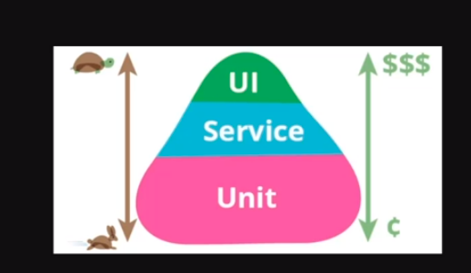

# Plantuml

- Acessar o projeto no terminal utilizando o comando:

```shell
code --no-sandbox .
```

- Instalar a extensão: https://marketplace.visualstudio.com/items?itemName=jebbs.plantuml

- Seguir as instruções conforme SO
- No caso do mac instalar:

```shell
brew install --cask temurin
brew install graphviz
```

----

## Utilizar o Docker para o node

- Adicionar o arquivo Dockerfile e docker-compose.yaml

- No Dockerfile temos definido o USER node, não é recomendado utilizar o usuário root, quanto menos privilégios mais seguro

- Para manter a máquina travada, sempre rodando deixamos um comando executando eternamente como no caso:

```
CMD ["tail", "-f", "/dev/null"]
```


- E depois de adicionar as configurações rodar o comando:

```shell
docker compose up --build
```

- E para ver se tudo está ok executar o comando:

```shell
docker compose exec app bash
```

- Dentro dele podemos executar o comando:

```shell
npm init -y
```

- E instalar as dependencias

- Para gerar o arquivo tsconfig utilizar o comando:

```shell
npx tsc --init
```

---

### Jest

- Instalar as dependencias de desenvolvimento:

```shell
npm install jest @types/jest -D
```

- Executar o comando:

```shell
npx jest --init
```
- Para transpilar os testes de  forma mais rápida de ts para js vamos utilizar o `swc`:

```shell
npm install @swc/core @swc/jest -D
```

- e no arquivo `jest.config.ts` adicionar o seguinte:

```ts
transform: {
    "^.+\\.ts?$": ["@swc/jest"],
  },
```

---

### Tipos de testes

- Testes unitários `.spec.ts`
- Testes de integração `.ispec.ts`
- Testes end to end `.e2e.ts`

- Deve levar em conta a piramide de testes...



---

### Objetos de valores

- Para objetos de valores utilizamos no final do nome do arquivo o `.vo`
- Ex.:
`src/@seedwork/domain/unique-entity-id.vo.ts`